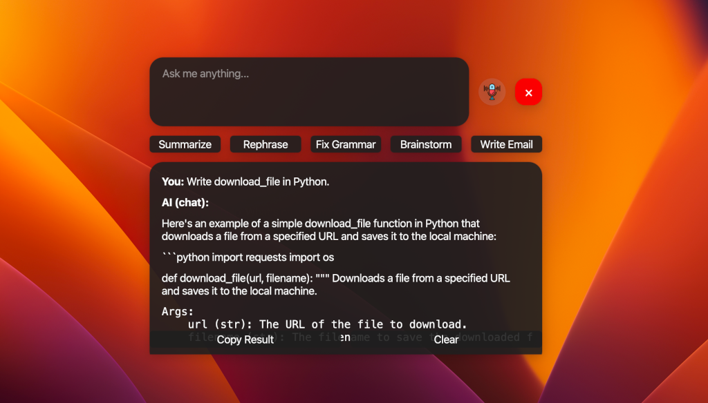

# LLaMA Assistant - With LLAMA 3.2

This is a simple assistant that can help you with your daily tasks. It can do things like set reminders, take notes, and even tell you the weather.

**Note:** It is a work in progress and I am constantly adding new features to it.



**Technologies Used:**

- Python 3.10+.
- LLaMA 3.2.
- SpeechRecognition 3.8.
- PyQt6.

## Installation

To install the assistant, you can simply clone the repository and run the following command:

```bash
pip install -r requirements.txt
```

## Usage

To use the assistant, you can run the following command:

```bash
python main.py
```

## References

- <a href="https://www.flaticon.com/free-icons/radio" title="radio icons">Radio icons created by Freepik - Flaticon</a>
